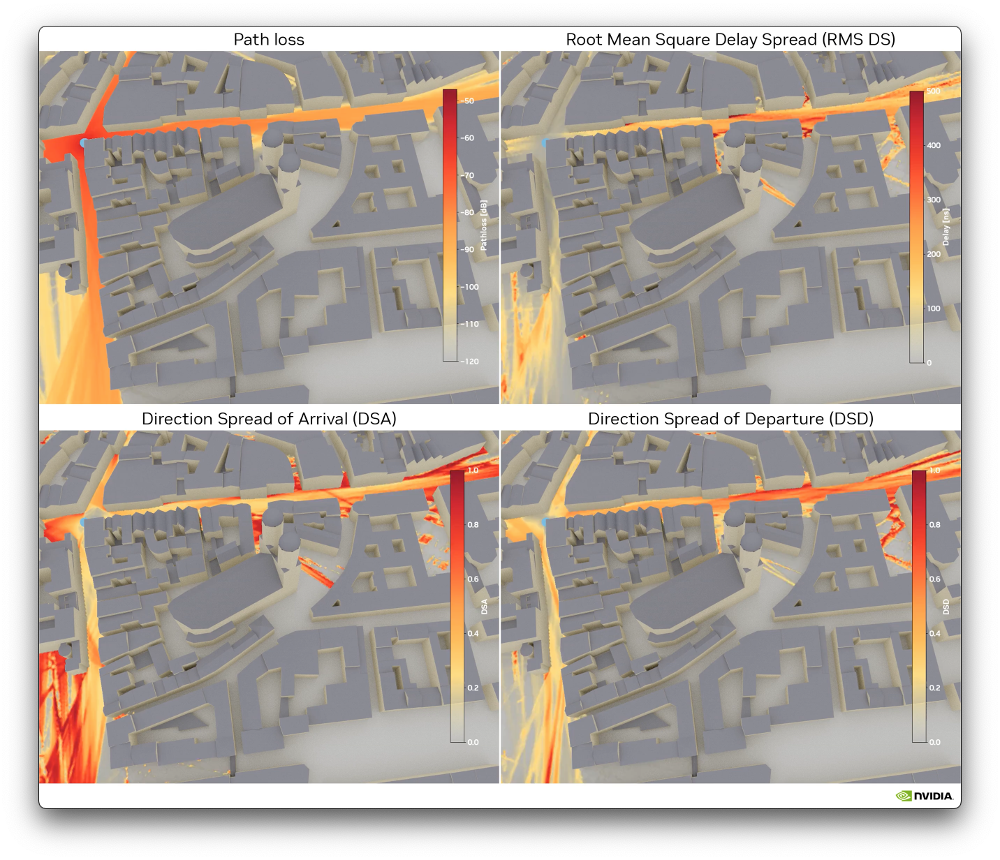
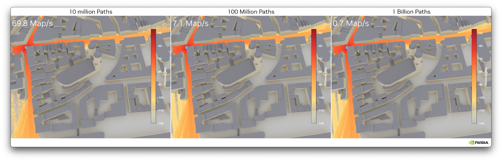
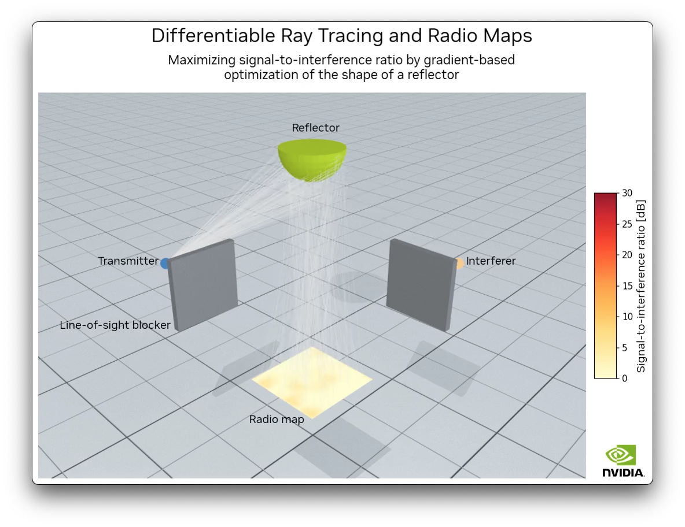

<!--
SPDX-FileCopyrightText: Copyright (c) 2024 NVIDIA CORPORATION & AFFILIATES. All rights reserved.
SPDX-License-Identifier: LicenseRef-NvidiaProprietary

NVIDIA CORPORATION, its affiliates and licensors retain all intellectual
property and proprietary rights in and to this material, related
documentation and any modifications thereto. Any use, reproduction,
disclosure or distribution of this material and related documentation
without an express license agreement from NVIDIA CORPORATION or
its affiliates is strictly prohibited.
-->

# Instant Radio Maps - Fast and Differentiable Radio Maps

**Instant Radio Maps (Instant RM)** is a differentiable ray tracer that enables the
computation of large and high resolution radio maps at rates on the order of **100 maps
per second** (depending on the available hardware and configuration).

It currently supports the computation of radio maps for the following quantities:
- Path loss
- Root mean square delay spread (RMS DS)
- Mean direction of arrival and departure

Radio maps for the direction spread of arrival (DSA) and departure (DSD) can be computed
from the mean direction of arrival and departure, respectively. 

Since Instant RM is fully differentiable, it enables the computation of
gradients of functions of the radio maps with respect to the material properties as well as the **scene geometry**.

Click on the image below to see the corresponding video.

[](https://drive.google.com/file/d/1Ks2yjX6HdHFhZOlKV5BWOQC74os4GF3h)

The number of samples used to trace radio maps controls a trade-off between the required latency and accuracy.

[](https://drive.google.com/file/d/1LU9zBx8PcNq4w7jegPiZ4huGxs7Hma2l)

These videos use a scene containing the area around the Frauenkirche in Munich.
The scene was created with data downloaded from [OpenStreetMap](https://www.openstreetmap.org) and
the help of [Blender](https://www.blender.org) and the [Blender-OSM](https://github.com/vvoovv/blender-osm)
and [Mitsuba Blender](https://github.com/mitsuba-renderer/mitsuba-blender) add-ons.
The data is licensed under the [Open Data Commons Open Database License (ODbL)](https://openstreetmap.org/copyright).

# Installation

Instant RM is based on [Mitsuba 3](https://mitsuba.readthedocs.io/en/latest/) and
[Dr.Jit](https://drjit.readthedocs.io/en/latest/).
The [`cuda_ad_mono_polarized`](https://mitsuba.readthedocs.io/en/latest/src/key_topics/variants.html#sec-variants) variant is required to run Instant RM.
As this variant is not included in the version of Mitsuba available on [PyPI](https://pypi.org/project/mitsuba/), Mitsuba should not be installed using [`pip`](https://packaging.python.org/en/latest/tutorials/installing-packages/) and you will
need to [install it from the sources with this variant](https://mitsuba.readthedocs.io/en/latest/src/developer_guide/compiling.html).
Selecting variants can be achieved by adding `"cuda_ad_mono_polarized"` to the listd named `"enabled"` in the `mitsuba.conf` file which is generated when running CMake.
Note that compiling Mitsuba also installs Dr.Jit from the source.
We recommend using Mitsuba 3.5.2. To clone this specific version, use the following command:
```sh
git clone --recursive  https://github.com/mitsuba-renderer/mitsuba3.git --branch v3.5.2
```

Once Mitsuba is compiled, you should run the [`setpath.sh` script](https://mitsuba.readthedocs.io/en/latest/src/developer_guide/compiling.html#running-mitsuba) located in the `build` directory to configure the environment variables required to use Mitsuba.
If you are using [JuptyterLab](https://jupyter.org/), you will need to run this script *before* starting the JupyterLab server:

```sh
source setpath.sh
python -m jupyterlab
```

Another option is to instruct the Python interpreter to search in the relevant directory
for the Mitsuba and Dr.Jit modules. This can be achieved by adding these two lines of code to the beginning
of Python scripts and notebooks:

```python
import sys
sys.path.append("path/to/mitsuba3/build/python")
```

where `"path/to/mitsuba3/"` should be replaced by the correct path to the root folder of the Mitsuba repository.

The other required packages can be installed 
by executing the following command from the root folder of this repository:

```sh
pip install -r requirements.txt
```

You can then install Instant RM by running:

```sh
pip install .
```

Additional packages are required to run the [tests](tests/):

```sh
pip install -r requirements_tests.txt
```

# Usage

The [tutorial](notebooks/Tutorial.ipynb) demonstrates how to use Instant RM and gives a tour of its features.

You can then have a look at the [calibration](notebooks/Calibration.ipynb) and [differentiable tracing of geometry](notebooks/Differentiable_Geometry.ipynb) notebooks for more advanced examples.

Note that the notebook on differentiable tracing of geometry features a companion video demonstrating the optimization of geometry, which was rendered from the notebook's results.
Click on the image below to see the video.

[](https://drive.google.com/file/d/1_16xMYBlSa_kJlqoGusKk6iJAQRvBi47)

# Setting materials

Instant RM supports both specular and diffuse reflections.
For diffuse reflections, the three scattering models from [Degli-Esposti-07](https://ieeexplore.ieee.org/abstract/document/4052607/) are implemented, i.e., Lambertian, directive, and backscattering lobe.
As the directive model is a special case of the backscattering lobe model, both are implemented as the same material type called `backscattering`.
The Lambertian model is implemented as a separate model (`lambertian`).
A `smooth` model, that corresponds to a perfectly smooth material that reflects waves specularly only, is also implemented.
Take a look at the [Primer on Electromagnetics from the Sionna documentation](https://nvlabs.github.io/sionna/em_primer.html) for an introduction to radio wave propagation.

The following properties need to be set to define radio materials:
- `eta_r` $\geq 1$ : Real component of the complex relative permittivity
- `eta_i` > $0$ : Imaginary component of the complex relative permittivity
- `s` $\in (0,1)$ : Scattering coefficient. Only needed for `lambertian` and `backscattering`. Controls the ratio of energy that is diffusely scattered. Zero means only specular reflections and results in a model equivalent to `smooth`.
- `alpha_r` integer $\geq 1$ : Parameter related to the width of the scattering lobe in the direction of the specular reflection.
Only required for `backscattering`.
- `alpha_i` integer $\geq 1$ : Parameter related to the width of the scattering lobe in the incoming direction.
Only required for `backscattering`.
- `lambda` $\in (0,1)$ : Parameter determining the percentage of the diffusely reflected energy in the lobe around the specular reflection. Setting this parameter to one results in no backscattered energy and corresponds to the directive model.

These scattering models need to be used to specify the radio materials when defining a Mitsuba scene.
Note that multiple materials of the same type can be defined using different values for the material properties.
Below is an example of how to use these material models to define a scene using the [XML file format](https://mitsuba.readthedocs.io/en/latest/src/key_topics/scene_format.html).

```xml
<scene version="2.1.0">

    <!-- Define materials -->

    <!-- Smooth model: Only specular reflections -->
    <bsdf type="smooth" id="my_smooth_material">
        <float name="eta_r" value="5.24"/>
        <float name="eta_i" value="0.63214296"/>
    </bsdf>

     <!-- Lambertian model -->
    <bsdf type="lambertian" id="my_lambertian_material">
        <float name="eta_r" value="1.99"/>
        <float name="eta_i" value="0.09243433"/>
        <float name="s" value="0.3"/>
    </bsdf>

    <!-- Backscattering lobe model -->
    <bsdf type="backscattering" id="my_backscattering_material">
        <float name="eta_r" value="1.99"/>
        <float name="eta_i" value="0.7"/>
        <float name="s" value="0.5"/>
        <integer name="alpha_r" value="5"/>
        <integer name="alpha_i" value="10"/>
        <float name="lambda" value="0.5"/>
    </bsdf>

    <!-- Directive model -->
    <bsdf type="backscattering" id="my_directive_material">
        <float name="eta_r" value="1.99"/>
        <float name="eta_i" value="0.7"/>
        <float name="s" value="0.5"/>
        <integer name="alpha_r" value="5"/>
        <integer name="alpha_i" value="10"/>
        <float name="lambda" value="1.0"/> <!-- Directive-->
    </bsdf>

    <!-- ...
        More materials
        ... -->

<!-- Shapes -->
    <!-- Tip: Merging shapes results in significant speed-up! -->
    <shape type="merge">

        <shape type="ply" id="my_shape_0">
            <string name="filename" value="meshes/shape_0.ply"/>
            <boolean name="face_normals" value="true"/>
            <!-- Uses `my_smooth_material` -->
            <ref id="my_smooth_material" name="bsdf"/>
        </shape>

        <shape type="ply" id="my_shape_1">
            <string name="filename" value="meshes/shape_1.ply"/>
            <boolean name="face_normals" value="true"/>
            <!-- Uses `my_lambertian_material` -->
            <ref id="my_lambertian_material" name="bsdf"/>
        </shape>

        <shape type="ply" id="my_shape_2">
            <string name="filename" value="meshes/shape_2.ply"/>
            <boolean name="face_normals" value="true"/>
            <!-- Uses `my_backscattering_material` -->
            <ref id="my_backscattering_material" name="bsdf"/>
        </shape>

        <shape type="ply" id="my_shape_3">
            <string name="filename" value="meshes/shape_3.ply"/>
            <boolean name="face_normals" value="true"/>
            <!-- Uses `my_directive_material` -->
            <ref id="my_directive_material" name="bsdf"/>
        </shape>

        <!-- ...
             More shapes
             ... -->

	</shape>
</scene>
```

# License

Copyright © 2024, NVIDIA Corporation. All rights reserved.

This work is made available under the NVIDIA License. Click [here](LICENSE.txt) to view a copy of this license.

# Citation

```
@software{instant_rm,
    title = {Instant Radio Maps},
    author = {Fayçal Aït Aoudia and Jakob Hoydis and Merlin Nimier-David and Sebastian Cammerer and Alexander Keller},
    note = {https://github.com/NVlabs/instant-rm},
    year = 2024
}
```
